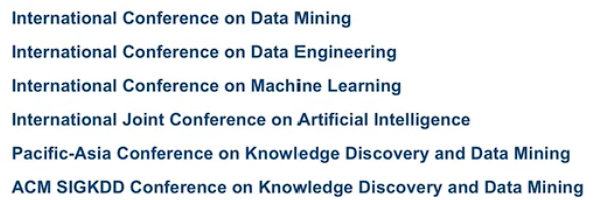
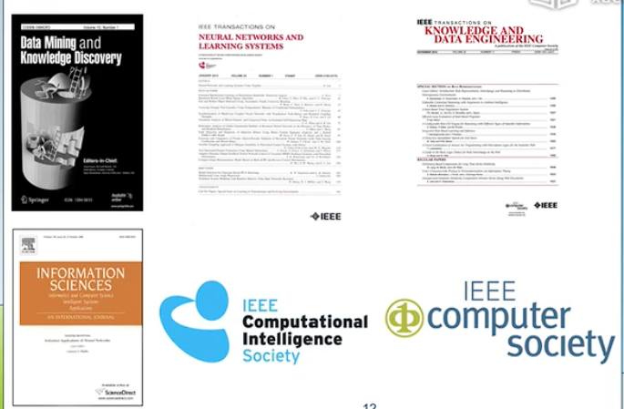
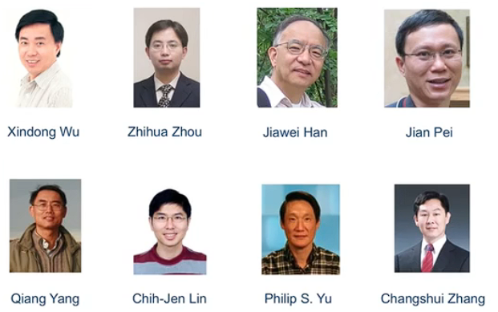
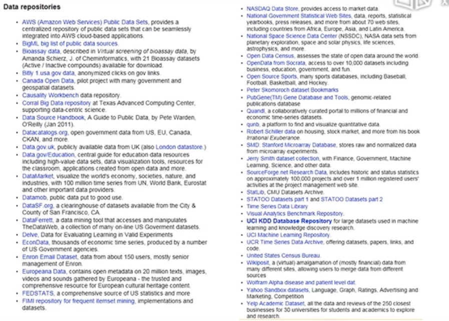
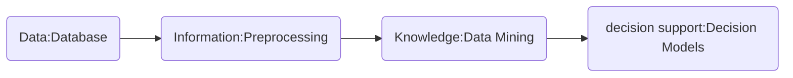
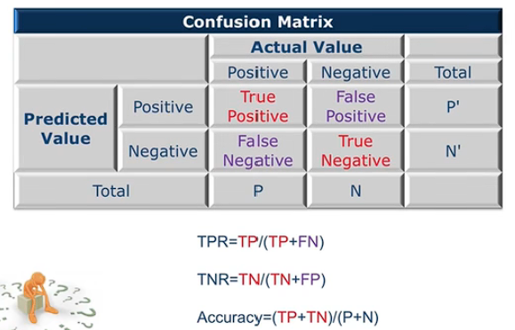
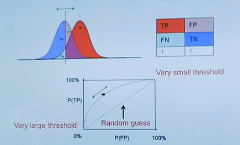

# 1.1 整装待发

data mining前提：00~07年数据存储能力大幅提升。

data无处不在

data rich，information poor。

# 1.2 学而不思则惘

## learning resources

data mining书籍推荐。

国际会议：

看国际会议以了解行业最新动态。

一些顶级期刊：

行业大牛：

搜索工具：

1. google（scholar）
2. weka
3. UCI：machine learning repository
4. matlab
5. KDnuggets

data mining是一个多学科综合起来的领域，data mining是一个很宽泛的概念，big data和data analytics等归根结底都是data mining。

如何学好：

1. 思考讨论
2. 阅读材料
3. 练习应用

学会思考。

# 1.3 知行合一

什么是data，data is not information

data types：

- binary
- symbolic

storage：

- physical
- logical

major issues：

- transformation
- errors and corruption

什么是big data，3个v：high-volume、high-velocity、high-variety。

说明了目前进行 data mining 的难点和要点在哪里。

big data 的现实应用：

1. 降低犯罪率
2. 药量的定制化（画饼，: P）
3. urban planning
4. location data（记录顾客在商场中的游览顺序，在货架的停留事件等）
5. retail data（进行精准广告投送）
   - sentiment analysis
6. social network
7. sports：利用数据分析，分析球员潜力，以最少资金获取最具潜力的球员。（真实案例）
8. attractiveness mining（哈哈，以非诚勿扰作为案例分析哪些女人好看）

小结：简单介绍 data 的概念种类以及应用。

# 1.4 从数据到知识

## open data

where ot find data？

画质太低了：各种领域的data

open government data

## data mining

- definition：data mining 是一个从繁杂海量且不完整的数据中提取出**有趣**且**有用的隐式**模式（patterns）。
- synonym：knowledge discovery

## business intelligence

data mining 在 business intelligence的各种应用，类似球员潜力分析。

## from data to intelligence

ETL：一种数据分析软件。

介绍了一些商业 data mining 软件。

# 1.5 分类问题（Classification）

准备讲一些算法。

## cross validation

注意 Training set与Test set不能使用同一个set。

介绍了训练模型的基本流程。

## Confusion Matrix

  

## Receiver Opetating Characteristic

ROC 曲线

Receiver operating characteristic (ROC) analysis is **a graphical approach for analyzing the performance of a classifier**. 

AUC stands for "**Area under the ROC Curve**."

## cost sensitive learning

提及Confusion Matrix在现实生活中 TP，RF等的权重问题。

## lift analysis

经过分析使得成本降低。

# 1.6 聚类问题及其他数据挖掘问题（Clustering）

## Hierarchical Cluster

> 分层聚类

## Association Rule

> 关联规则

买了a，b就很容易去买c

## Regression

> 回归

## Performance Dashboard

一些有趣的可视化软件，善于利用可视化软件。

## Data Preprocessing

data preprocessing是data mining中最有挑战性的部分。

# 1.7 隐私保护与并行计算

## Privacy Portection

举了一个例子，在不获取用户隐私的情况下获取到我想要得到的数据。

人群中吸大麻比例调查问题。

## Cloud Computing

pay as you go：现付现用

definition：cloud computing is the on-demand delivery of IT resources over the Internet with pay-as-you-go pricing。

## Parallel Computing

## Mobile Supercomputing

## The Big Picture

data + model + computer --> data mining （for golden）

## No Free Luch

各种算法和模型各有优势和短板，学习多种算法和模型按照实际问题的具体情况选择最佳的算法。

# 1.8 迷雾重重

股票走向

彩票预测

## Grouping

处理数据的时候需要注意数据的内在分组。

## Violent Crime vs. Vedio Games

注意数据的相关性，x影响y，是否有直接的影响。

## Tricky？

## Survivorship Bias

幸存者偏差:)

小结： 从各种角度和层次来看问题。

