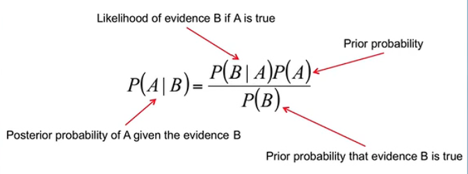
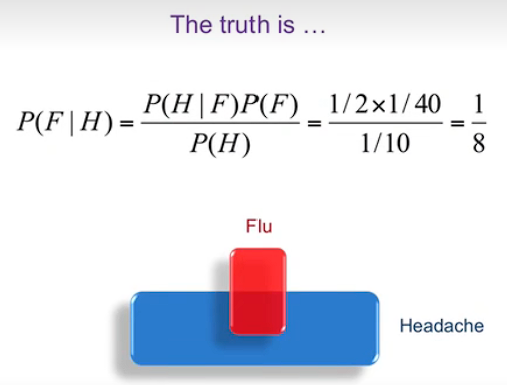
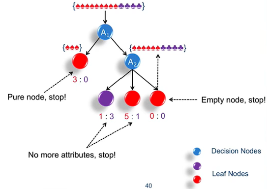
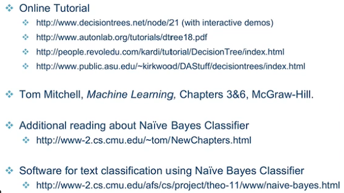

# 3.1 贝叶斯奇幻之旅

## Classification

classification is a kind of supervisor learning.

there is <input, output> in classification.

what is supervisor means: 

## Classifiers

training a classifiers.

举了几个例子：教开车...

## Bayes Theorem

公式：

可视化 Bayes 公式：[这里](https://www.bilibili.com/video/BV1R7411a76r/?spm_id_from=333.337.search-card.all.click&vd_source=2456bd97f87d1daadd52439e6aaac59a)。让 Bayes 公式更新你的观点，而不是改变你的观点。

### fish example

猜鱼...

### Shooting Example

### Cancel Example

 

### Headache & Flu Example

有点意思：

# 3.2 朴素是一种美德

## Naive Bayes 

两个公式...

## Independence

独立概率

## Conditional Independence

条件概率

吸烟例子
格子例子
抛硬币例子...

## Independent $\ne$ Uncorrelation

## Estimating  $P(a_j|\omega_i)$

Laplace Smoothing...有个公式

Tennis Example

Text Classification Example

Text Representation
计算感兴趣单词的频率...

Case Study: Newsgroups

# 3.3 数据、规则与树

## Decision Making

简单介绍...

## A Survey Dataset

市场调研进行用户画像。

## A Tree Model

使用决策树细化庞大的数据，最好是让叶子结点为“纯的”。（即x：0或0:y）

## Some Notes...

强调了一下，性能相同选结构简单的树。

# 3.4 植树造林学问大

## ID3

如何选择`属性`，即树的节点。
ID3，迭代？

## Entropy

用数学方法来衡量这些`属性`。
使用 Entropy来衡量节点的重要性。
有个公式...

## Attribute Selection

information gain 越高越好

## ID3 Framework

基本思想在3.3节 a tree model已陈述过。

举个例子：

## Overfitting

overfitting：A训练集性能比B的好，测试集相反。

如何解决overfitting：

1. 限制决策树的长度。
2. 剪枝

## Pruning

剪枝是改善模型在ValidationSet的性能。通过Pruning不断的减少节点时，在模型 ValidationSet 误差曲线的拐点处停止Pruning。

## Entropy Bias

有个公式...

Continuous Attributes
连续的属性例如温度，如何进行 threshold 的选定，通过计算 Gain，gain越大越适合当作 threshold。

Reading Materials

c4.5决策树？

