# 4.1 智慧之源神经元

## Overview


## Biological Motivation

生物上的神经元...


大脑的力量来自于并行。（parallelism）


## Case Study

神经网络如何学习？

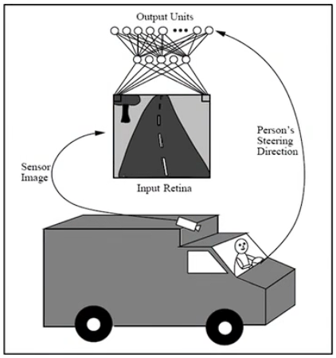


## Perceptrons

> Perceptrons：感知器，就是一个神经元。


```
x:属性
w：权重
w_0：偏置？当
```

超平面这里不是很理解。


## Power of Perceptrons

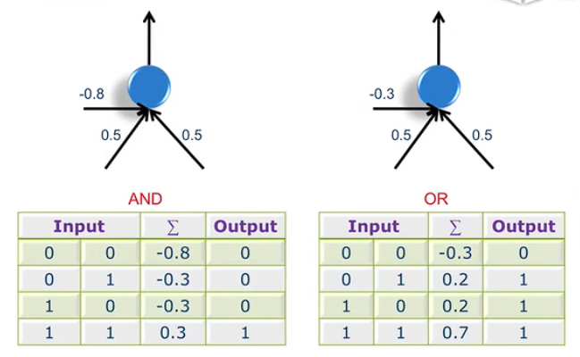

通过控制$w_0$ 的数值来模拟与门和或门。上图中 $w_0$ 为 `-0.8` 和 `-0.3`.

# 4.2 会学习的神经元

## Error Surface

如何得到 $w_0$ 权重？


## 如何修正权重？

### Gradient Descent

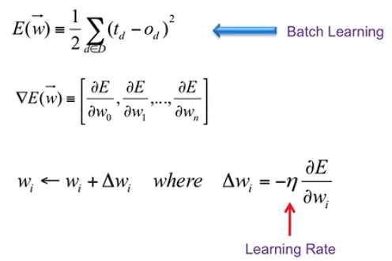

> D：训练集
>
> t：target，期望或者目标输出
>
> o：实际的输出
>
> E：误差
>
> $\eta$ 为**学习率**。

$\Delta w_i = -\eta\frac {\partial E} {\partial w_i}$ 公式内误差对权重求偏导，为什么要加负号：

偏导为正时，权重增加，误差也增加，即此时偏导大于零，而我们希望的是误差越来越小。故$\eta$ 前加个负号。

偏导为负时，权重增加，误差反而减小，即此时偏导小于零，而我们希望的是误差越来越小。故$\eta$ 前加个负号。


### Delta Rule

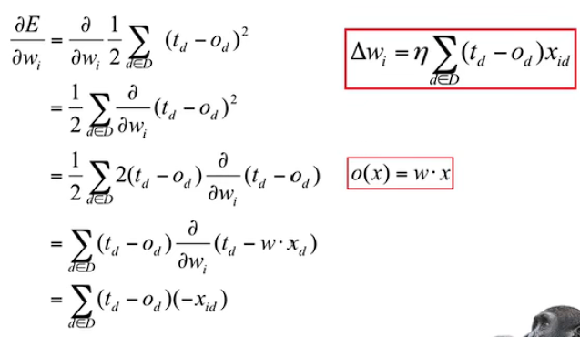

当$t_d - o_d > 0$ ，即期望输出大于实际输出。此时需要实际输出更加靠近期望输出：

当 $x_{id}>0,t_d>0,o_d>0$ 时，$\Delta w_i$ 为正，故$w$ 增大，此时$o(x)=w·x$ 增大。 

~~当  $x_{id}<0,t_d>0,o_d>0$ 时，$\Delta w_i$ 为负，故$w$ 减小，此时$o(x)=w·x$ 增大。~~（该条推断是矛盾的）


## Batch Learning

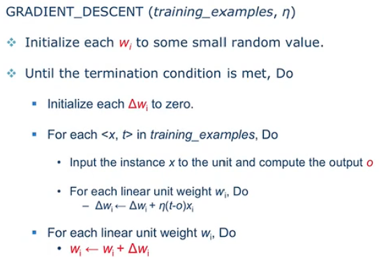

小结：计算出一个属性的$\eta (t-o)x_i$ ， $w_i$ 就更新一下。直到所有属性计算完后再更新$w_i$.（这应该是单个神经元权重的计算）


## Stochastic Learning

...

# 4.3 从一个到一群

## Multilayer Perceptron

> 因为单个感知机无法完成线性不可分的分类问题，故使用多层感知机。

多层感知机结构：

注意：Hidden layer 可以由多层组成，上结构图将其省略为一层。


## XOR

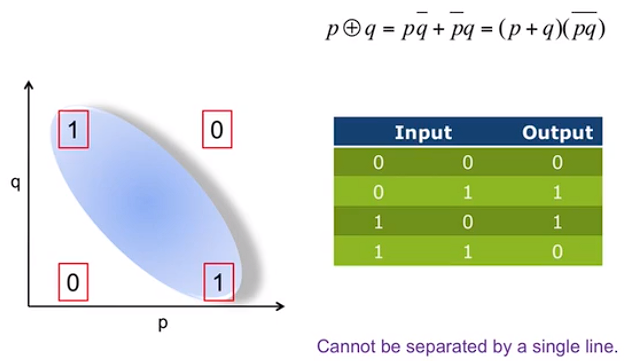

解决办法：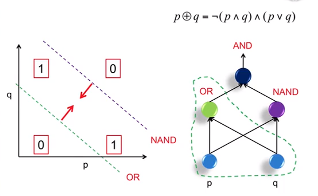

这不就是电路嘛...


## Hidden Layer Representation

> representation：表示

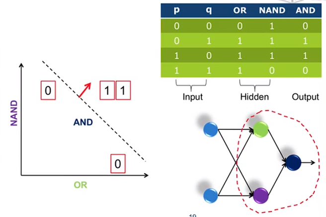

将图中红色圈抽象成一个“感知机”。

将原始复杂问题简化。


## The Sigmoid Threshold Unit

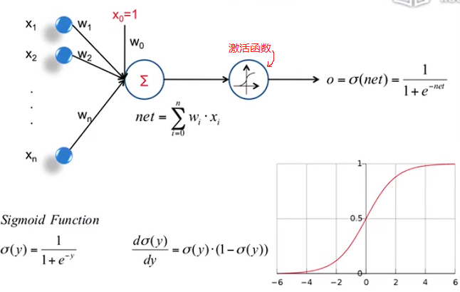

优点：

1. 将输入输出漂亮的映射。
2. 导数可以直接计算出来。

注意：导数可以直接计算出来，由此得出当输入为0时导数最大，故一般将权重设置的比较小。

# 4.4 层次分明，责任到人

## Backpropagation Rule

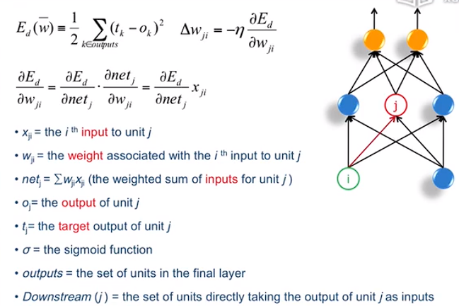


### Traning Rule for Output units

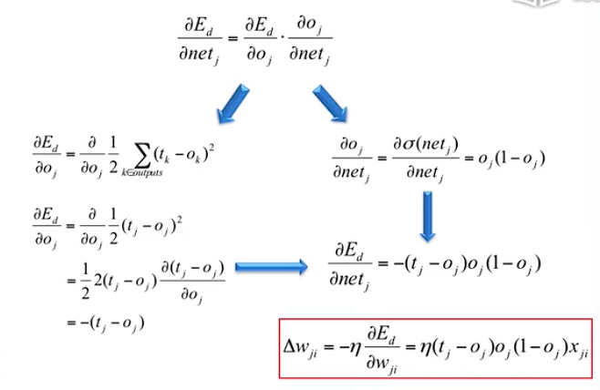

误差逆传播算法推导：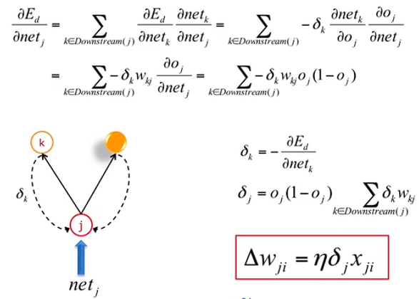

小结：算法其核心是通过输出k的误差，来反映隐藏层 j 的误差，以此来修正 j 的权重。

### BP Framework

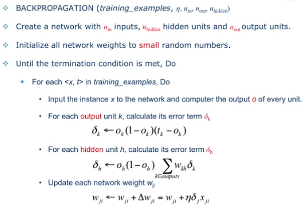

## More about BP Networks...

> Local Minima：局部最小值。

如何处理 Local Minima 问题。

...

Overfitting


Practical Considerations：实际考虑。

- Monmentum（冲量）
- Adaptive learning rate


# 4.5 管中窥豹，抛砖引玉

## Beyond BP Networks

> 介绍了两个其他的神经网络

### Elman Network

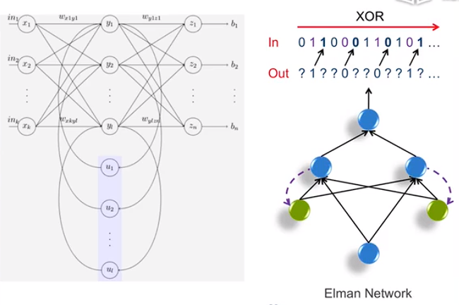

小结：具有一定的上下文记忆功能。上图的绿色结点实现类似记忆功能。

### Hopefield Network

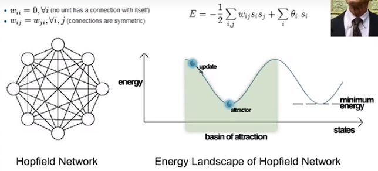

给予若干pattern，通过该网络记住某个pattern。


## When does ANN work?

训练时间长，但好用。

不具有可解释性。


## Reading Materials

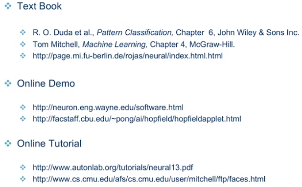