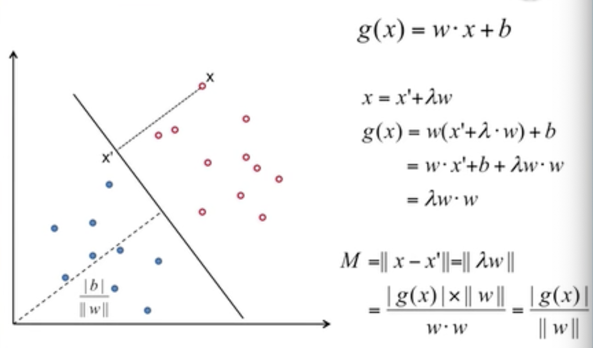
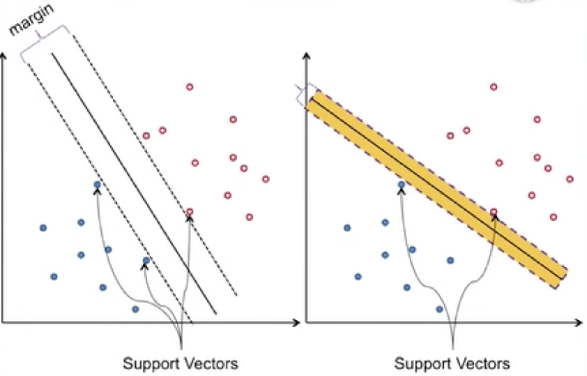
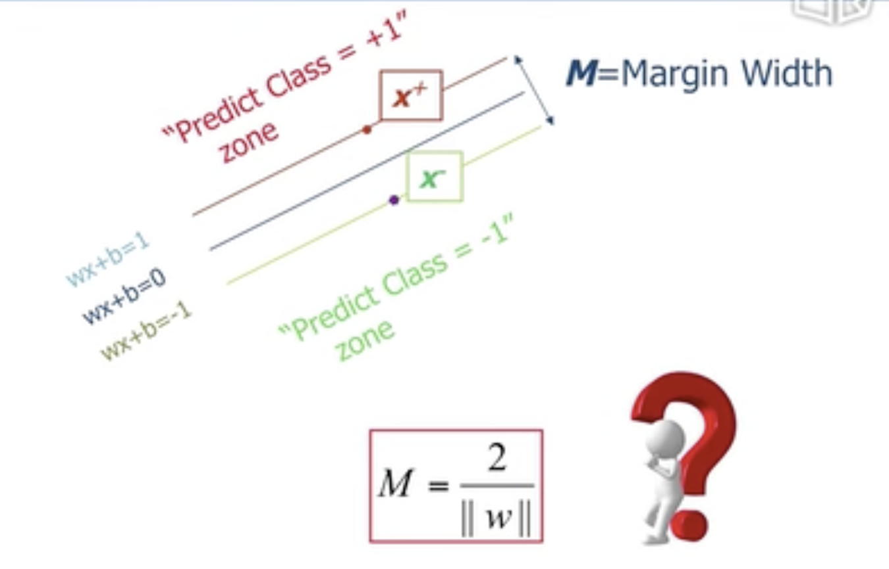
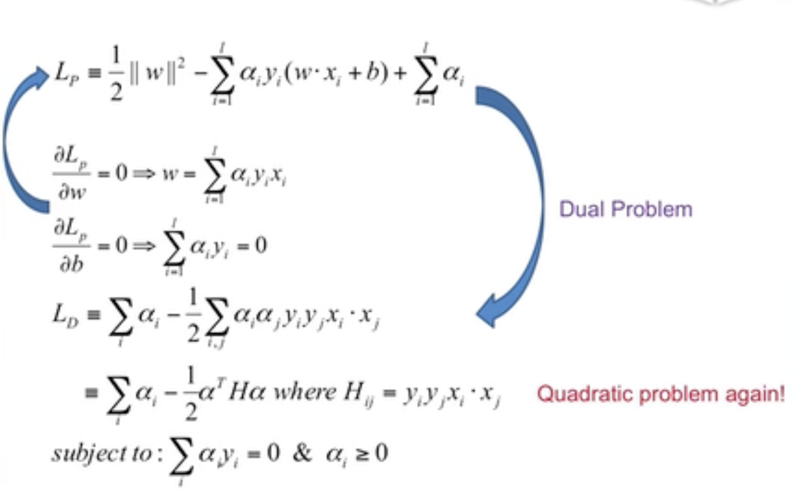
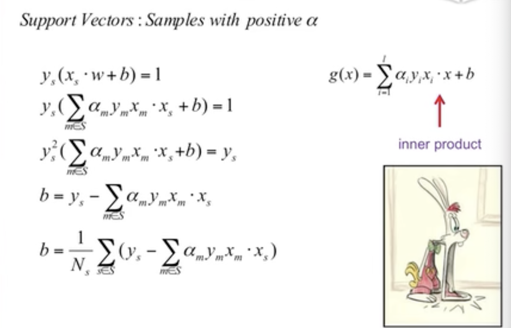
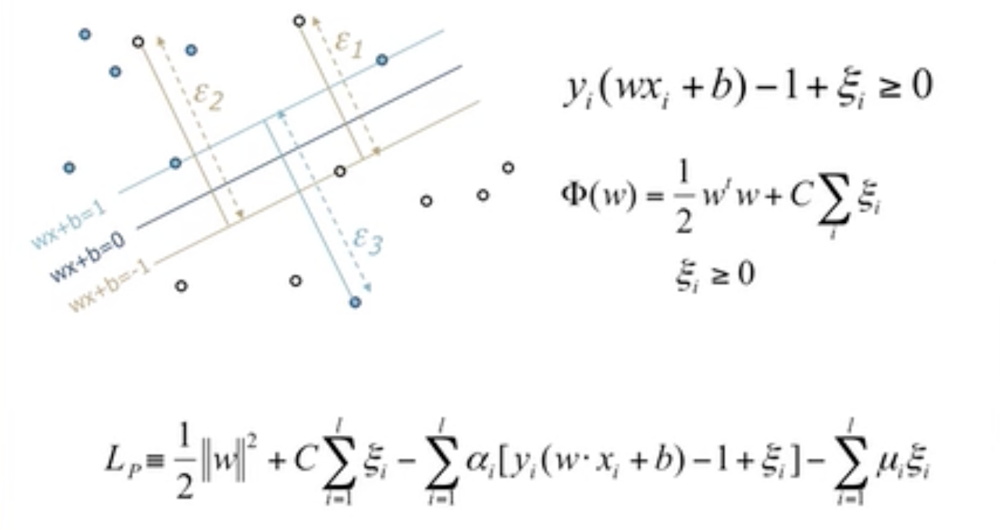
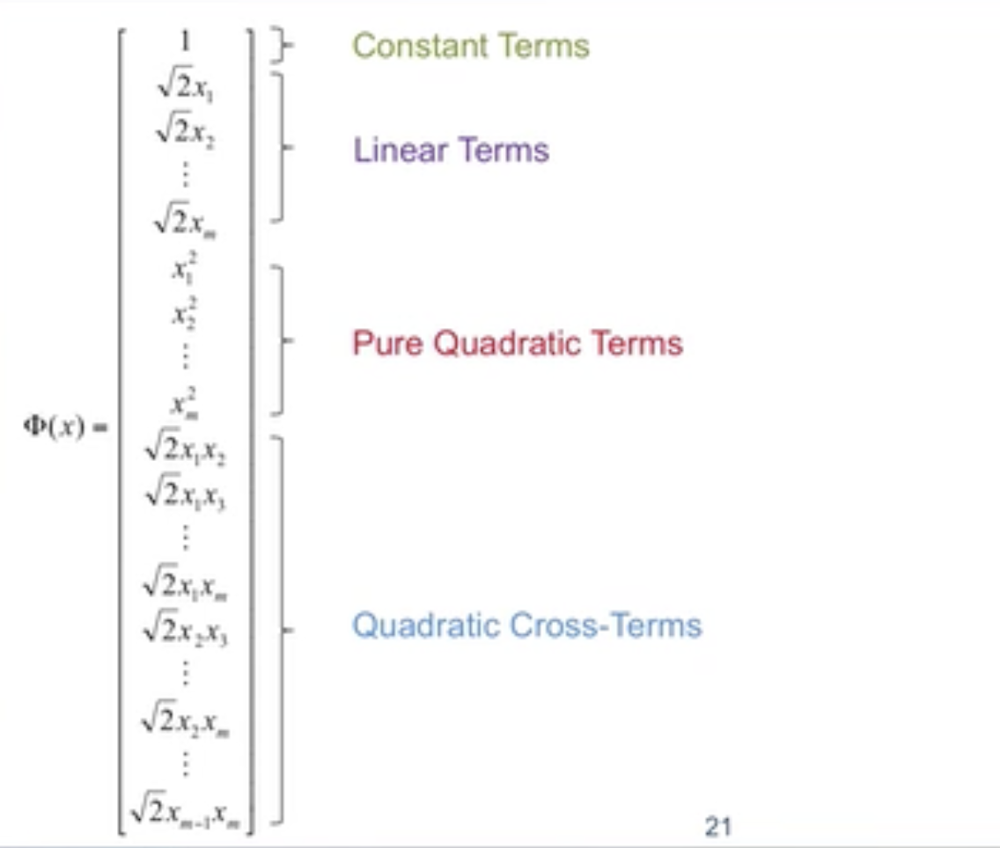
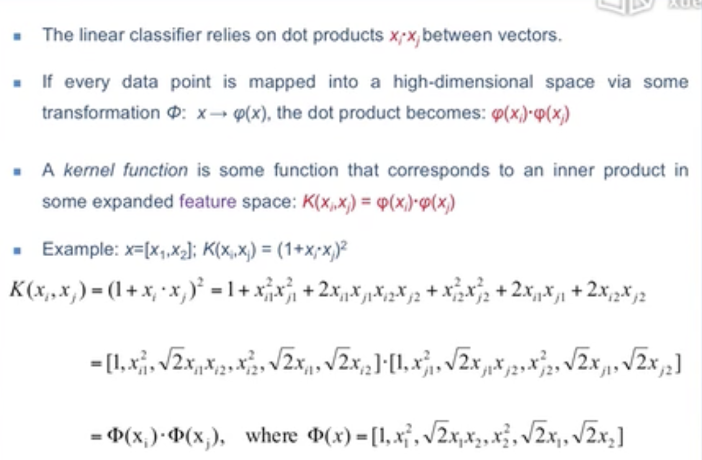
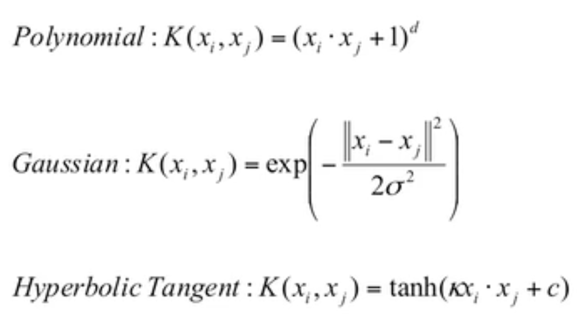
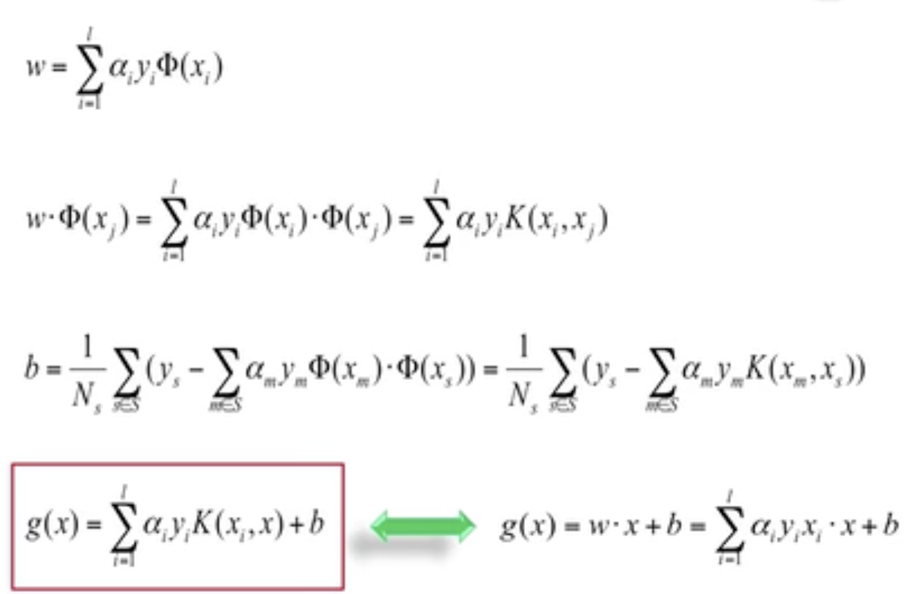

# 5.1 最大间隔

低纬到高纬。

Distance to Hyperplane：

## Selection of classifier

多个感知机生成的多个分类器，尽量选择将**空白部分**平分的分类器。

## Margins

> Margin 中文翻译为 **间隔**。

选择不同的分类器，其margin 和 support vectors会不同。

margin，support vectors示意图：

小结：

Liner Support Vector Machine（LSVM）线性支持向量机：仍然是一个线性分类器，与其他线性分类器相比它的margin是最大的。

最大化公式Margin：$M=\frac2{||w||}$

# 5.2 线性SVM

## Objective Function

> Objective Function，目标函数

两个目标：

1. 分对
2. margin最大化

## Lagrange Multipliers

## Solutions of w&b

## Soft Margin

某些情况下分类器并不能完全的将所有的点分对。

# 5.3 数学家的把戏

## Non-liner SVMs

针对某些线性不可分的数据，将其映射到另一个维度使其线性可分，该另一个维度叫Feature Space（特征空间）。

注意：针对同一问题其映射的方法并不唯一。

## Quadratic Basis Function

> Quadratic Basis Function：二次基函数

映射方法一般使用几种常用的方法。

## Kernel Trick

## Kernels

## Solutions of w & b

# 5.4 致敬真神

## SVM Roadmap

`Liner Classifer(Maximum Margin)`

 `=> `

 `Linear SVM(Noise) `

 `=> `

 `Soft Margin(Nonliner Promblem) `

 `=>`

$a·b->\Phi(a)·\Phi(b)$`(High Computational Cost) `

`=>`

`Kernel Trick`($K(a,b)=\Phi(a)·\Phi(b)$)

经过多年的发展才形成现代的SVM模型。

## Model Capacity

Capacity是一个非正式的术语。 它与模型复杂性非常接近（如果不是同义词的话）。 这是一种谈论模型可以表达多么复杂的模式或关系的方式。 可以期望容量较高的模型能够比容量较低的模型建模更多变量之间的关系。

## VC Dimension

从数学的角度给出解释，当训练误差相同时选择复杂度较低的模型。