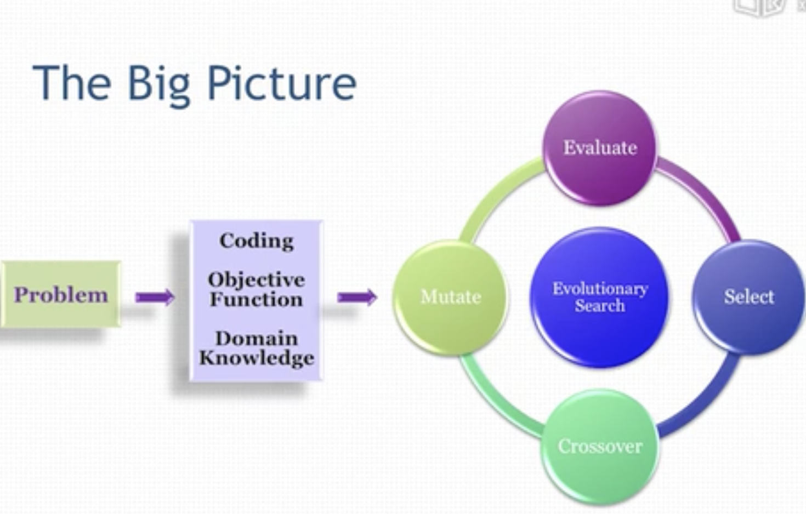
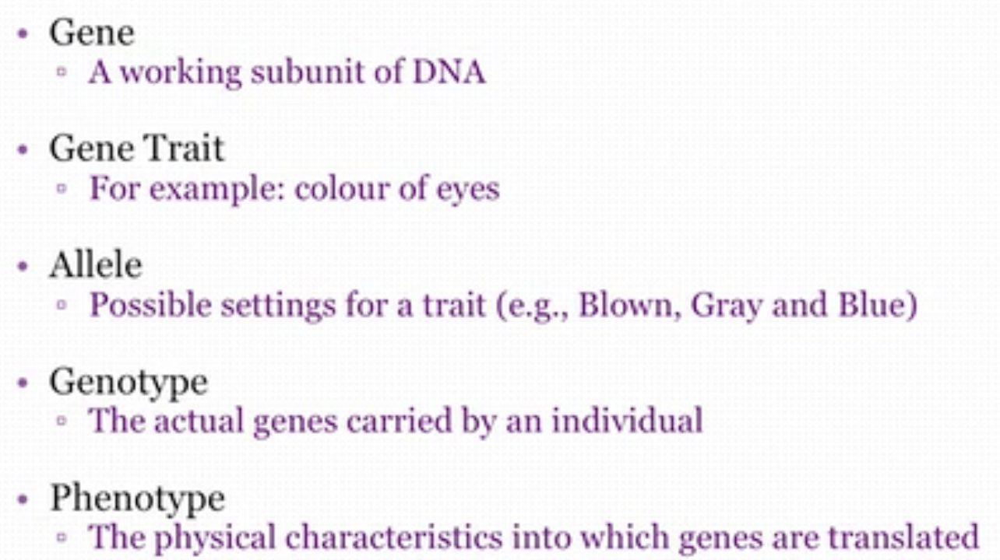
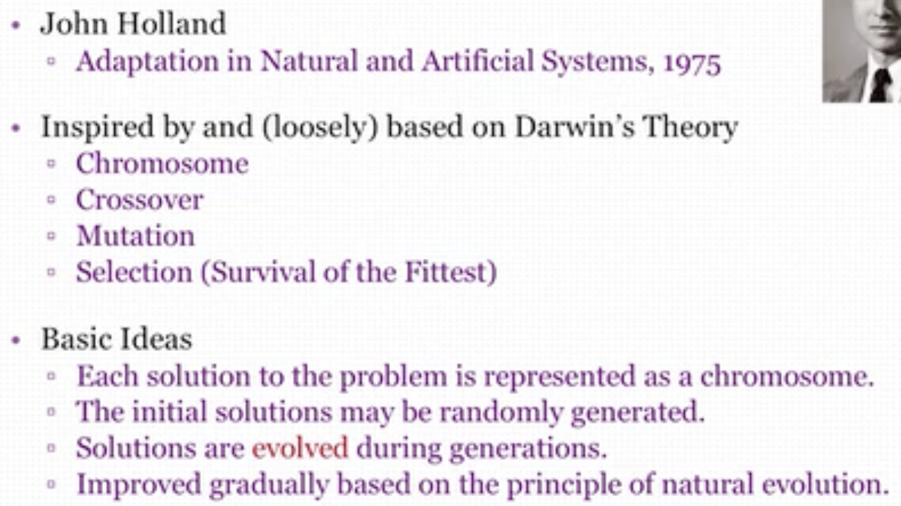
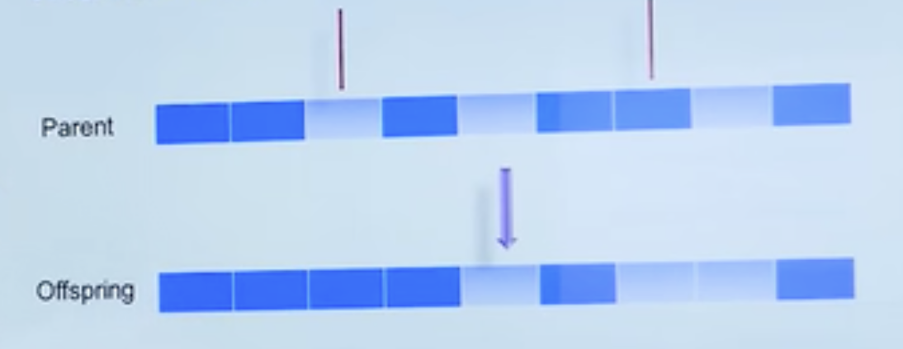
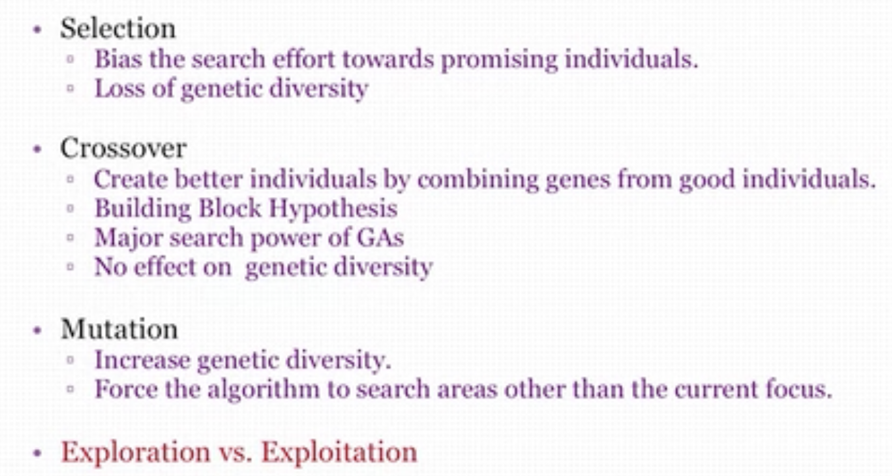
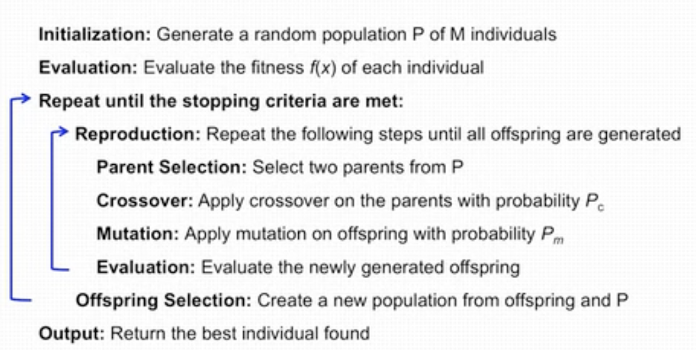
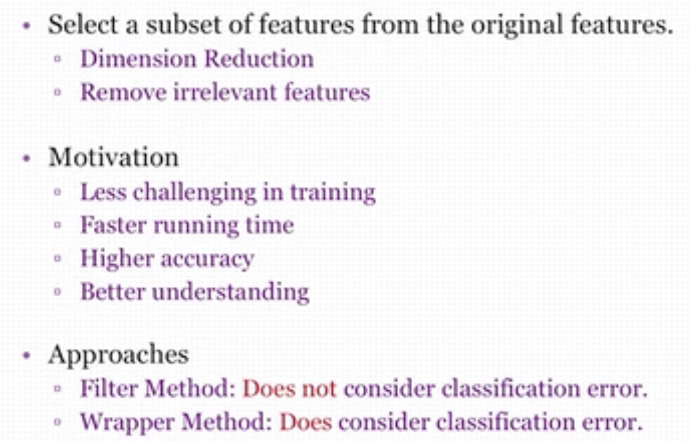
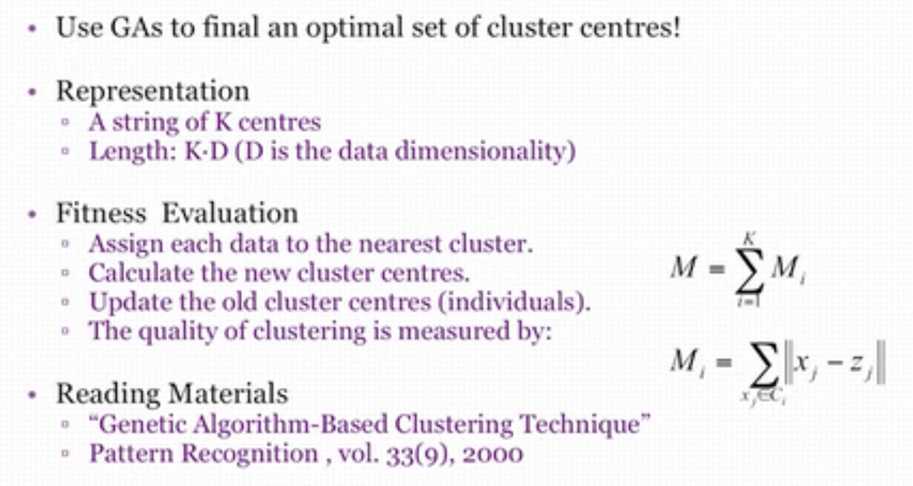
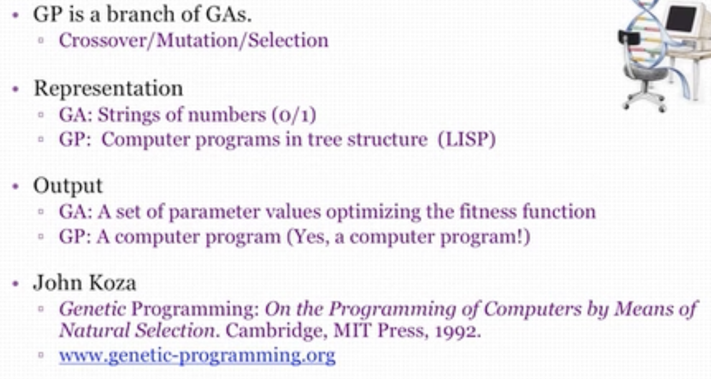
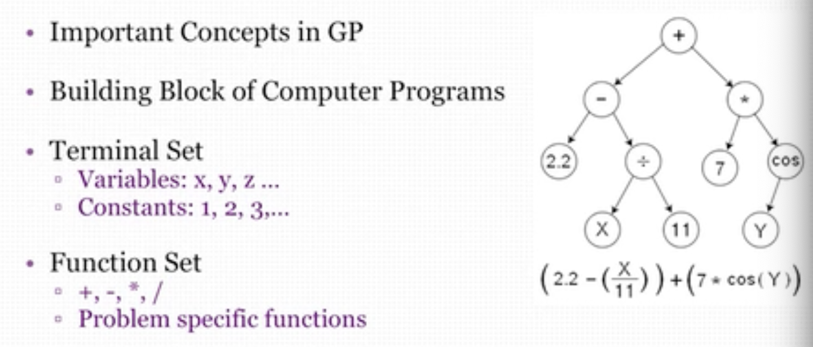

# 10.1 人与自然

该文章对进化计算有一个全面概要的介绍：[进化计算_百度百科 (baidu.com)](https://baike.baidu.com/item/进化计算/3768586)。

Overview:

- Global Optimization
- Genetic Algorithms
- Genetic Programming
- Evolvable Things

Motivation of EAs: Optimization for our subject

Key Concepts:

- Population-Based Stochastic Optimization Mehtod（基于数量的随机优化方法。）
- Inherently Parallel（本质上并行的）
-  A Good Example of Bionics in Engineering（生物工程）
- Survival of the Fittest（适者生存）
- Chromosome, Crossover, Mutation（染色体，杂交，变异）
- Metaheuristics（元启发算法）
- Bio-/Nature Inspired Computing

The big picture

## EA Family

它有一系列的算法。

# 10.2 尽善尽美

Bin Packing 优化算法：

- First fit algorithms
- First Fit decreasing algorithms（先排序再放）

用几个例子说明优化问题无法用暴力算法解出。

# 10.3 走向进化

防止陷入局部最优化的方法：Parellel search

介绍了领域内的人与相关书籍。

Blondie24，自监督学习的跳棋软件。

# 10.4 遗传算法初探

生物学背景：

Genetic Algorithms:

## Basic Components

组成：

- Representation：如何编码的问题。
  - Individual(Chromosome)，A vector that represent a specific solution to the promblem.
  - Population, A set of individuals.
  - Offspring(后代), New individuals generated via genetic operators.
  - Encoding, Binary vs. Gray 
- Genetic Operator：杂交和变异。
- Selection Strategy：选择 

Gray 码，任意两个相邻的编码之间只有一位的不同。

## Selection

种类：

1. Roulette Wheel Selection（某个体分数占所有个体分数和的百分比来排名）
2. Rank Selection（按分数排名，解决了有负数的问题）
3. Tournament Selection
4. Elitism（精英选择）

# 10.5 遗传算法进阶

## Crossover

种类：

1. One point crossover：选一个点，该点后面的所有点进行交换。
2. Two point crossover：选两个点，两点之间的元素进行交换。
3. Uniform Crossover：对所有的点，若两元素不相同则随机选择其中一个元素继承。

## Mutation

Selection vs. Crossover vs. Mutation: 

GA Frameworks的完整流程：

Parameters:

- Population Size
  - Too big：Slow convergence rate（减慢收敛速度）
  - Too small：Premature convergence（不成熟的收敛，即收敛的局部最优点）
- Crossover Rate
  - Recommended value：0.8
- Mutation Rate
  - Recommend value：1/L
- Selecton Strateg，使用上面提到的算法。

## Feature Selection

## GAs & Clustering

Pareto Front

给出所有“好”的解，让用户来选择最适合他自己目标任务的解。

# 10.6 遗传程序设计

> GA: Genetic algorithms，遗传算法。
>
> GP: Genetic Programming，遗传编程。

GA vs. GP

Function & Terminals

Crossover

树也可以进行杂交。

Mutation

对树的某个节点进行变异。

# 10.7 万物皆进化

Evolvable Circuits，可进化电路。

通过控制不同电路不同部分的断开和连接来实现不同的功能，以达到可编程的功能。

Antenna for NASA

Car Design, 使用机器设计汽车。

Artificial Life，通过程序以实现某个目的自主设计结构。

Evolutionary Arts

