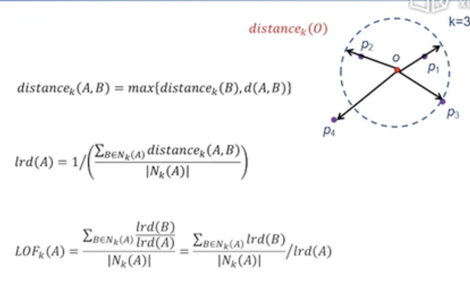
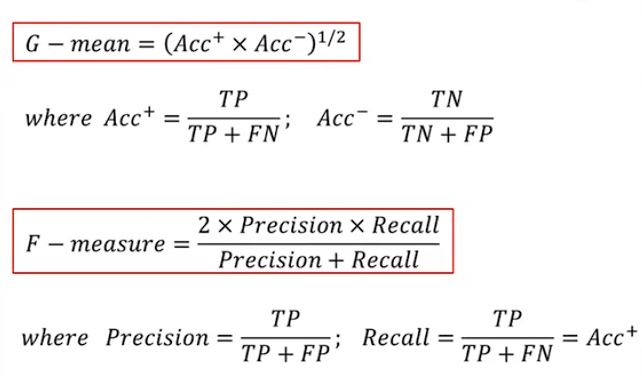
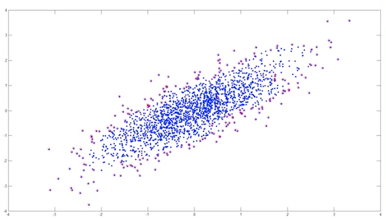
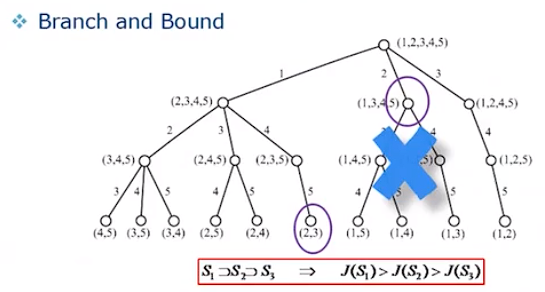
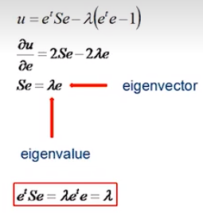
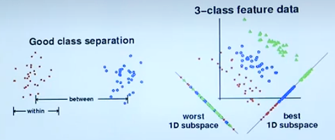
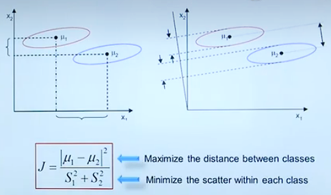
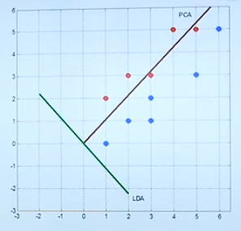
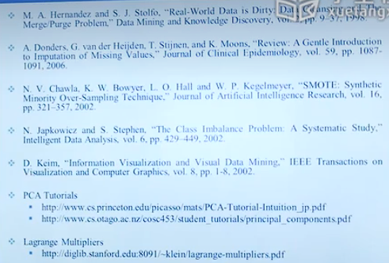

Data Preprocessing：数据预处理

真实的 data mining 绝大部分时间花费在 data preprocessing。

# 2.1 数据清洗

## Missing Data

Data are not always available

Possible Reasons

- Equipment malfunction
- Data not provied
- Not Applicable（N/A）（不适用）

Different Types

- Completely random
- Conditionally random
- Not missing

## how to handle missing data？

- 忽视
- 人工填写
- 自动填写

## Outliers

> 离群点

## Anomaly vs. Outliers

> 异常 vs. 离群

小结：列举数据缺失的各种可能性，缺失的原因以及若干种如何因对确实的方法；介绍了利群点的概念并说明了离群点与异常点本质是不同的。

# 2.2 异常值与重复数据监测

## Local Outlier Factor

计算距离公式：

## Duplicata Data

slide window，前提：可能重复的数据在数据库中是靠近的。

步骤：

```mermaid
graph LR
1(Create Keys) --> 2(Sort) --> 3(Merge)
```

编写规则合并两个相似的项时需要注意其属性对应的文化背景。比如中国人同姓的人多，欧美人同名的人多。

小结：介绍了异常值如何得出的基本思想以及一个计算公式；合并重复数据的基本思想。

# 2.3 类型转换与采样

> Data Transportation：类型转换。
>
> 说明：经过上一节的步骤，now we have an error free dataset.

Attribute Types：

- Continuous（连续的）
- Discrete（离散的）
- Ordinal（序数的）: Rankings:{Average, Good, Best}
- Nominal（名义上的）: {Red, Green, Blue}, {Teacher, Worker}
- String

## Type Conversion（类型转变）

以Nominal类型的颜色编码问题为引子，简单介绍了编码背后隐藏的问题：不同的编码表示在空间上的距离是不同的。

解决办法：假设有三种颜色，使用的编码为：001，010，100。此时三种编码在空间距离上是一致的。

## Sampling（采样）

为什么采取采样？

- CPU运算很快，但是IO相比于CPU运算太慢。

- 统计学采用采样是因为，**采样成本**过于**昂贵**。而在Data Mining中是因为，**数据量**过大，无法全部处理所以采用采样。

## Aggregation（聚集）

适当的放大范围

## Imbalanced Datasets

数据集很多情况下数据种类数量是极度不平衡的。使用 G-mean 该衡量指标可以剔除“来了都说好”这类的模型算法。

## Over-Sampling（向上采样）

在 Imbalance Datasets 中通过一些算法将较少数量的元素进行“复制”增多，以达到更好的模型训练效果。

## Boundary Sampling（边界采样）

当数据量十分庞大时，采取Boundary Sampling 便可使用少量的点来描述整个数据集。节省资源。

# 2.4 数据描述与可视化

## Normalization

- Min-max normalization：将有明确区间的数据使用公式1映射到(0.0, 1.0) 区间
  $$
  公式1：v'=\frac{v-min}{max-min}(new\_max-new\_min)+new\_min
  $$
  
- Z-score normalization （$\mu$: mean, $\sigma$, : standard deviation），偏离均值多少个标准差。
  $$
  公式2：v'=\frac{v-\mu}{\sigma}
  $$
  

## Data Description

- Mean
- Median
- Mode（The most frequently occuring value in a list for non-numerical data）
- Variance（方差）：Degree of diversity，有两个公式。

如何计算两组数据的相关性，有两个公式...

## 数据可视化

- 1D，饼状图，柱状图之类的。
- 2D，使用matlab。
- 3D，在matlab里使用Surf函数来可视化。

## Box Plots（High Dimensional）

matlab中的一个函数。缺点：丢失了维度与维度之间的关系。

## Parallel Coordinates：平行坐标（High Dimensional）

每条线代表一个**点**在多维的属性。

两个可视化软件：

- CiteSpace：文字可视化的软件。
- Gephi：

# 2.5 特征选择

两个核心算法：

Feature Selection（该小结讲述）

Feature Extraction（2.6小节讲述）

Class Distributions：

举了两个例子：

- 属性分类的好坏。
- 区别明显属性可以提高判断的成功率。

Entropy（熵）

Information Gain（信息增效，在学习决策树时会使用到）当你获得一个属性时，不确定性下降的幅度即information gain。

Feature Subset Search

要从海量的 Features 中选择出最能使某元素确定的少量 Features，遍历所有组合一般不太现实。此时我们使用到 Branch and Bound（分支定界）

> 红字说明：使用BAD的前提，当属性单调减少时，其 J(暂定为能效) 也单调减少。

其他一些方法？：

- Top K Individual Features：找最好的 K 个属性组合在一起。
- Sequential Forward Selection：先找一个最好的属性F1，在F1的基础上加一个属性，遍历**二属性组**，找到最好的二属性组。以此递增。
- Sequential Backward Selection：同上，反之。

小结：这些方法难以找到最优解。

Optimization Algorithms：

- Simulated Annealing（模拟退火）
- Tabu Search（禁忌搜索）
- Genetic Algorithms（遗传算法）

# 2.6主成分分析（数学元素较多，较难）

FS和FE的不同点

多维数据压缩到低维会损失很多的信息，如何在压缩维度的同时尽可能的减少信息的损失。

2D Example

Variance：information。差异越大则该属性越重要。（因为该属性能更好的使元素区分开来。）

另一个例子：Remove correlation

Some Math

一些数学方法：

- 将二维数据进行变换的矩阵公式推导。
- 进行变换的过程中，新点与原点的距离最小则其信息损失最小。接下来便是距离最小公式的推导。最后通过 Lagrange Multipliers 解决（带约束条件的求最大值）

More Math

PCA：将原点数据投影到具有最大特征值的 S 的特征向量上。

PCA Examples
在matlab中实现PCA较为简单，给予了一个简单的例子，可以试着在matlab中实现。

Fish

# 2.7 线性判别分析

The Issue of PCA：

PCA is Unsupervisor，它不考虑class information。

## Linear Discriminant Analysis（LDA）

The objective of LDA is to perform dimension reduction while preserving as much of the **class discriminatory**（类的区别） information as possible。

Measure of Separability

> 组**内**属性尽可能**靠近**，组**外**属性尽可能**远离**。

Fisher Criterion

Some Math...

两分类问题投影方向的公式推导。[b站视频](https://www.bilibili.com/video/BV154411Q7mG?p=17&spm_id_from=pageDriver&vd_source=2456bd97f87d1daadd52439e6aaac59a 7:06)

LDA Example

对同样的数据分别使用PCA和LDA算法给出详细计算过程得出投影方向。从数学角度阐述了 PCA 与 LDA 本质上的区别。（区别，是否保留不同 class 间的 variance）下为 PCA 与 LAD 投影方向图。

C-Class LDA

介绍了 C-Class 投影的计算公式...

给出了一段可以在matlab上执行的代码。[b站](https://www.bilibili.com/video/BV154411Q7mG?p=18&spm_id_from=pageDriver&vd_source=2456bd97f87d1daadd52439e6aaac59a 8:38)

Limitation of LDA

阅读推荐：

