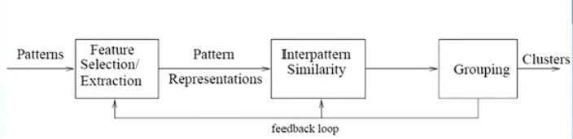
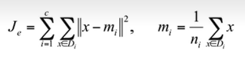
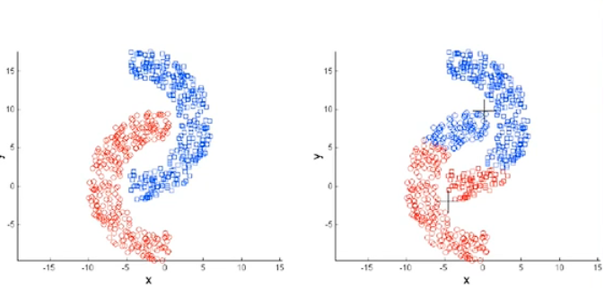
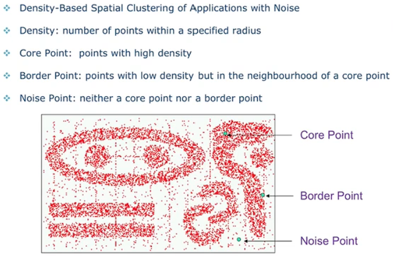
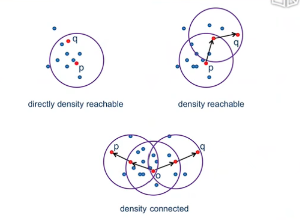
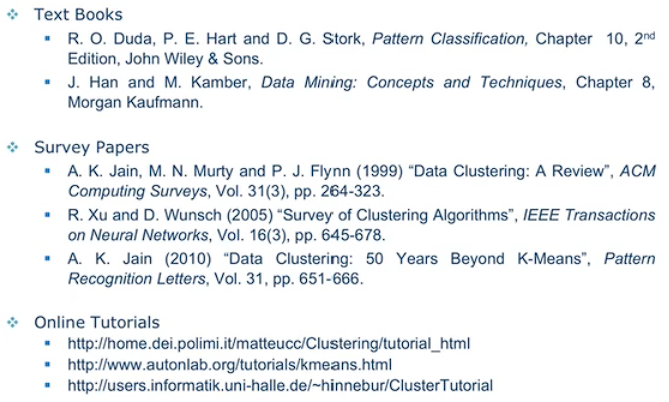

# 6.1 无监督学习（聚类）

## 聚类的分类

Partitioning Methods

- asdfas
- 阿斯顿发射点
- 阿斯顿发射点
- 阿斯顿发射点

Hierarchical Methods

聚类分析的定义...

## Applications of  Cluster

举了一些例子...

- 地震...
- Image Segmentation

## 聚类流程

interpattern similarity：模式间相似度

pattern representations：模式表示

## 使用聚类的要求

- Ability to discover clusters with **arbitrary shape**
- Ability to deal with **noise and outliers**

## Practical Considerations

> Practical: 实际的

数据预处理的坐标变换会影响聚类的结果。

Normalization or Not：归一化后也会影响聚类的结果。

# 6.2 K-Means

## Evaluation

距离公式：

存在的问题：假定聚类是呈球状的。

举例说明：

## Silhouette

解释和验证数据聚类的方法：有个公式...

举例：...

## K-Means

时间复杂度`O(r·k·n)`: 

- `t`：iteration
- `K` ：number of centroids（质心）（聚类的个数）
- `n` ：number of data points

缺点：

...

## Sequential Leader Clustering

优缺点...

需要设置`threshold`.

算法基本思想：顺序扫描一边所有元素，算出与所有与已知簇的中心点的距离，距离小于`Threshold`的为同一簇，大于的自立门户。

# 6.3 期望最大法

## Gaussian Mixture（model）

使用多个高斯函数来逼近已知数据，通过添加权重使所有高斯函数的面积仍为1.（多个高斯函数叠加有点想傅里叶级数）

## K-Means Revisited

## Expectation Maximization

EM算法

具体过程...

## EM：Gaussian Mixture

公式...

# 6.4 密度与层次

## Density Based Methonds

DBSCAN：

三个概念：

## Hierarchical Clustering

agglomerative Method

Example

Min vs. Max

Reading Materials

