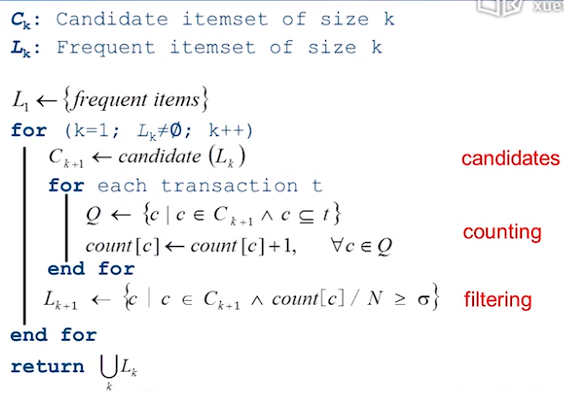
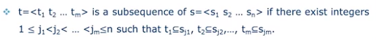
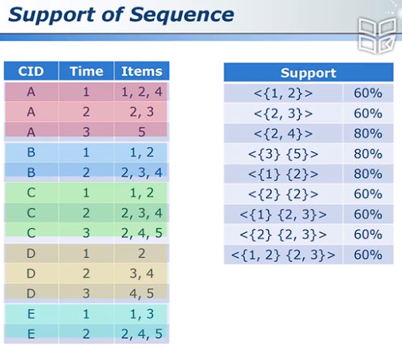

# 7.1 项集与规则

associate rule 定义：前项（Antecedent）和后项（Consequent）。前项是规则的先决条件，后项是规则的结果。这两部分之间用箭头连接。一个简单的关联规则的例子如下：如果{商品A}出现，那么{商品B}也很可能出现。关联规则的度量通常包括支持度（Support）和置信度（Confidence）。支持度表示规则中前项和后项同时出现的频率，而置信度表示在前项出现的条件下，后项也同时出现的概率。

# 7.2 支持度与置信度

$Support(X)=\frac {\#X}n$, 即`n`个`items`中 `X`出现的频率.

The **Support** of an Association rule: $Supoort(X\to Y)=\frac{\#(X\cup Y)}n$, 即同时购买了`X`和`Y`的频率

The **Confidence** of an Association rule: $Confidence(X\to Y)=\frac{\#(X\cup Y)}{\#(X)}$, 即购买了`X`的人数当中同时购买了`X` 和 `Y` 的比例。即条件概率...

# 7.3 误区

1. 算出`support`和`confidence`需要再去看商品本身`先验概率`。
2. 要注意`support`差距非常大的商品。
3. $Association\ne Causality$（有关系不等于有因果关系）

# 7.4  Apriori算法

> Apriori算法，数据挖掘十大算法

Key ideas：

- A subset of a frequent itemset must be frequent.（频繁`itemset`的子集一定频繁）
- The supersets of any infrequent itemset cannot be frequent.（不频繁的`itemset`的超集一定不频繁）

算法思想：

1. 选出1个频繁的item
2. 从频繁的item中选出2个频繁的
3. 以2类推...

如图：

# 7.5 实例分析

...

具体讲了如何计算出$C_3$，简单来说就是必须有$C_2=\{\{1,2\},\{1,5\},\{2,5\}\}$，才能推出$C_3=\{1,2,3\}$.

# 7.6 序列模式

> Sequential Pattern

什么是sequence？

答：具有先后顺序的 集合`list`。集合是`itemset`.

序列`t`是否是序列`s`的子序列, 看是否能在`s`内**按顺序**的找到`t`中集合的超集。

数学定义：

Support of Sequence：

