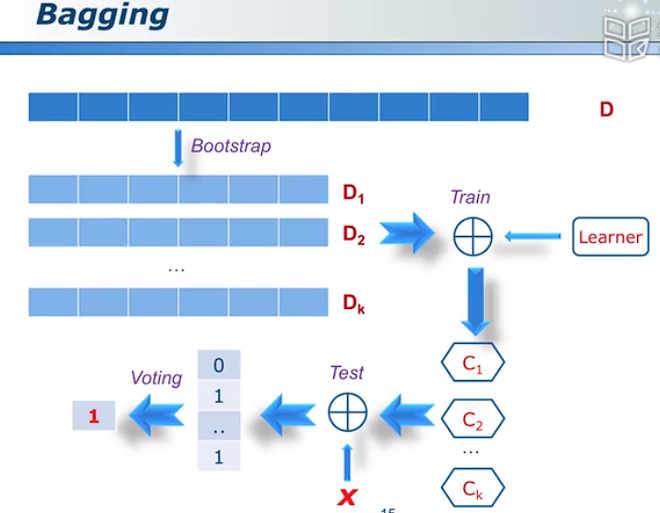
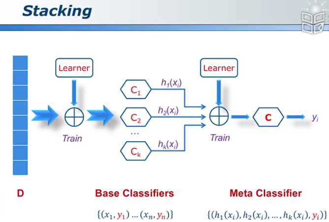
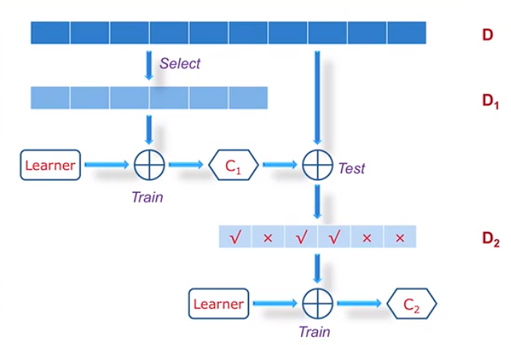

# Ensemble

图示：

## Model Selection

多个模型取平均，即集成学习（Ensemble learning）

## Divide and Conquer

大问题化为小问题。微分思想。

# Bagging

## Diversity

## Bootstrap Sample

使用有放回的抽样形成的数据集训练出的分类器可以视作不同的分类器。

## bagging 流程

图示：

> 图中Learner为模型

## Random Forest

> Bagging的算法之一，随机森林

### RF Main Features

### RF Advantages

# Boosting

> Stacking：加权重的Bagging

Stacking图示：

Bosting图示：

> 下图中$C_2$分类器着重训练$D_2$中判断错误的样本以实现分类器的互补。
>
> 注意：着重训练的方法是通过增加判断错误样本的权重实现的。

> 下图中$C_3$分类器负责解决$C_1,C_2$分类器同时分类时出现的判断不一致的问题。

# AdaBoost

>  数据挖掘十大算法之一

AdaBoost的优缺点：...

# RegionBoost

## Dynamic Weight Scheme

> 不同的输入在不同的分类器中的权重是不一样的

